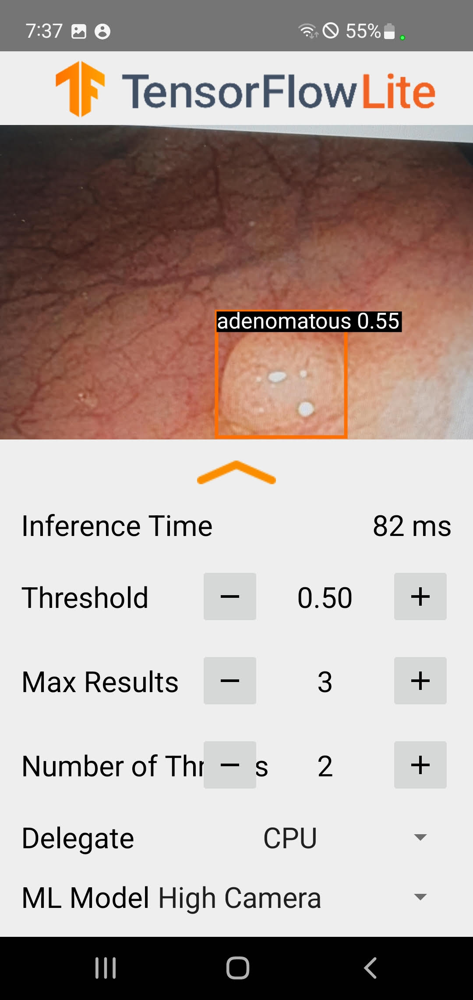

# TensorFlow Lite Polyp Detection for Android (Pilot study)

An open-source, real-time colonic polyp detector that runs on an ordinary Android smartphone, with no special hardware and no internet connection.

> **Research use only.** This app is a research prototype. It is not a medical device, has not been approved or cleared by any regulatory authority, and must not be used for clinical diagnosis or patient care decisions.

## Publication

This repository accompanies:

> Kim YB. Smartphone-based polyp detection: a first step towards an open-source AI framework. *J Med Artif Intell.* 2025;8:49. [doi:10.21037/jmai-24-310](https://doi.org/10.21037/jmai-24-310)

The work was first presented as an invited on-site poster at ESGE Days 2023 ("Home-Made Polyp-Detector: Deep-Learning Based Polyp Detector Using Android Smartphones").

If you use this software, please cite the paper above. GitHub's "Cite this repository" button uses [CITATION.cff](CITATION.cff).

## Overview

This application is a modification of the TensorFlow Lite [object detection example app](https://www.tensorflow.org/lite/android/tutorials/object_detection), a camera app that continuously detects and identifies general objects. This modified app detects and identifies colonic polyps using the device's back camera.

The polyp models are quantized [EfficientDet-Lite2](https://tfhub.dev/tensorflow/lite-model/efficientdet/lite2/detection/metadata/1) detectors trained on the following public dataset (CC0 1.0):

* Wang, Guanghui, 2021, "Replication Data for: Colonoscopy Polyp Detection and Classification: Dataset Creation and Comparative Evaluations", Harvard Dataverse, V1. [doi:10.7910/DVN/FCBUOR](https://doi.org/10.7910/DVN/FCBUOR)

For optimal performance, run the app on a physical Android device.

## Build the demo using Android Studio

### Prerequisites

*   The **[Android Studio](https://developer.android.com/studio/index.html)** IDE. This sample was tested on Android Studio Bumblebee.

*   An Android device with a minimum OS version of SDK 24 (Android 7.0 - Nougat) with developer mode enabled. The process for enabling developer mode can vary by device.

### Building

*   Clone this repository.

*   Launch Android Studio. From the Welcome screen, select "Open an existing Android Studio project."

*   In the "Open File or Project" window, select the root folder of this repository. Click OK.

*   If prompted for a Gradle Sync, confirm by clicking OK. Android Studio creates `local.properties` with your SDK path automatically; this file is not committed.

*   Connect your Android device to your computer with developer mode enabled, then click the green Run arrow to build and deploy the app.

### Models Used

The polyp detection models are bundled in `app/src/main/assets`. Select one from the "ML Model" menu in the app:

| File | Description |
| --- | --- |
| `efficientdet-lite-polyp.tflite` | Polyp detector (EfficientDet-Lite) |
| `efficientdet-lite2-polyp.tflite` | Polyp detector (EfficientDet-Lite2) |
| `efficientdet-lite2-selected.tflite` | Polyp detector (EfficientDet-Lite2, variant) |
| `efficientdet-lite2-camera.tflite` | Polyp detector (EfficientDet-Lite2, variant) |
| `efficientdet-lite2-high-camera.tflite` | Polyp detector (EfficientDet-Lite2, variant) |

The general-purpose TensorFlow models (MobileNet v1, EfficientDet-Lite0/1/2) are downloaded automatically at build time by `app/download_models.gradle`.

## License

The code is licensed under the [Apache License 2.0](LICENSE), the same license as the TensorFlow example it is based on. See [NOTICE](NOTICE) for attributions and third-party components. The training dataset is in the public domain under CC0 1.0 and is not redistributed here.
