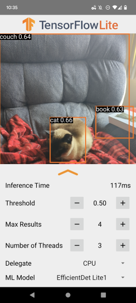

# TensorFlow Lite Polyp Detection Android Demo

### Overview

This application is a specialized camera app designed to continuously detect and identify polyps using your device's back camera. The app utilizes advanced models such as the quantized [EfficientDet Lite2](https://tfhub.dev/tensorflow/lite-model/efficientdet/lite2/detection/metadata/1) specifically trained for polyp detection from gastrointestinal imaging data. These instructions will guide you through the process of building and running the demo on an Android device.

The model files are seamlessly integrated into the app via Gradle scripts when you build and run the app, eliminating the need for manual downloads of TFLite models.

For optimal performance, this application should be operated on a physical Android device.

## Build the demo using Android Studio

### Prerequisites

*   The **[Android Studio](https://developer.android.com/studio/index.html)** IDE, with this sample tested successfully on Android Studio Bumblebee.

*   An Android device with a minimum OS version of SDK 24 (Android 7.0 - Nougat) with developer mode enabled. The process for enabling developer mode can vary by device.

### Building

*   Launch Android Studio. From the Welcome screen, select "Open an existing Android Studio project."

*   In the "Open File or Project" window that appears, navigate to and select the `tensorflow-lite/examples/polyp_detection/android` directory. Click OK.

*   If prompted for a Gradle Sync, confirm by clicking OK.

*   Connect your Android device to your computer with developer mode enabled, then click the green Run arrow in Android Studio to build and deploy the app.

### Models Used

The process of downloading, extracting, and placing the models into the app's assets folder is fully automated by the `download.gradle` file, requiring no additional steps from the user.
